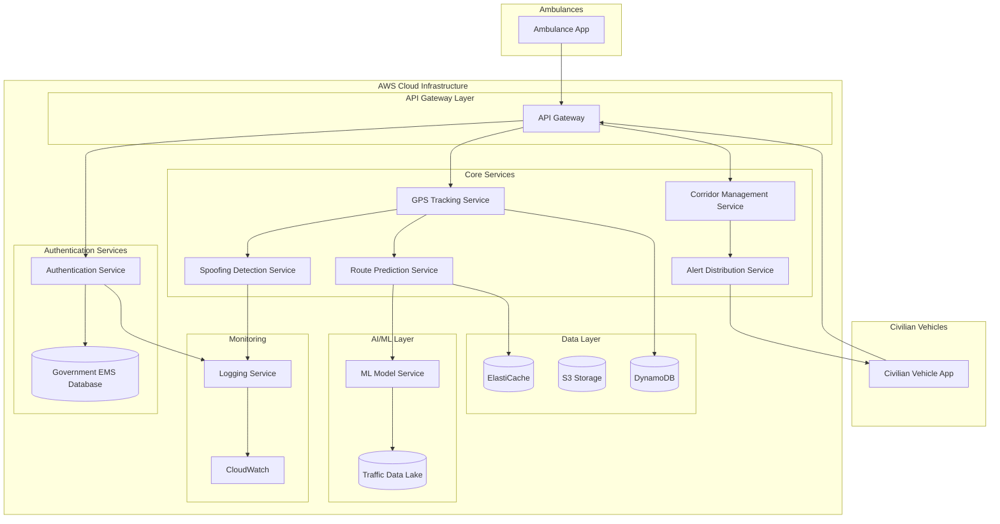

# Design Document: SankatMitra - Smart Emergency Corridor System

## Overview

SankatMitra (Friend in Distress) is a cloud-native, AI-powered platform that creates dynamic traffic corridors for ambulances across India. The system architecture follows a microservices pattern deployed on AWS, with real-time data processing, machine learning-based route optimization, and secure ambulance service coordination capabilities. The architecture is designed to support future integration with multi-agency disaster management systems.

The system consists of several key subsystems:
- **Authentication & Authorization Layer**: Validates ambulances against government databases
- **GPS Tracking & Anti-Spoofing Layer**: Monitors ambulance locations with fraud detection
- **AI Route Prediction Engine**: Calculates optimal paths using real-time traffic data
- **Alert Distribution System**: Sends targeted notifications to civilian vehicles
- **Data Security & Privacy Layer**: Ensures compliance and data protection
- **Future Extension Points**: Designed for multi-agency disaster coordination integration

## Architecture

### High-Level Architecture



### Deployment Architecture

The system uses AWS services for scalability and reliability:

- **Compute**: ECS Fargate for containerized microservices with auto-scaling
- **API Management**: API Gateway with Lambda authorizers for authentication
- **Database**: DynamoDB for low-latency vehicle state, RDS PostgreSQL for audit logs
- **Caching**: ElastiCache Redis for route predictions and traffic data
- **Storage**: S3 for historical data and ML model artifacts
- **ML Infrastructure**: SageMaker for model training and inference endpoints
- **Messaging**: SNS/SQS for asynchronous alert distribution
- **CDN**: CloudFront for mobile app content delivery
- **Monitoring**: CloudWatch, X-Ray for distributed tracing

### Regional Distribution

- **Primary Region**: Mumbai (ap-south-1) for lowest latency to major Indian cities
- **Secondary Region**: Hyderabad (ap-south-2) for disaster recovery
- **Data Residency**: All data stored within Indian AWS regions per compliance requirements

## Components and Interfaces

### 1. Authentication Service

**Responsibility**: Verify ambulance credentials against government database

**Interfaces**:
```typescript
interface AuthenticationService {
  authenticateVehicle(vehicleId: string, credentials: Credentials): Promise<AuthResult>
  validateToken(token: string): Promise<TokenValidation>
  revokeAccess(vehicleId: string, reason: string): Promise<void>
}

interface AuthResult {
  success: boolean
  token?: string
  vehicleType: 'AMBULANCE'
  expiresAt: Date
  errorCode?: string
}

interface Credentials {
  vehicleId: string
  registrationNumber: string
  agencyId: string
  digitalSignature: string
}
```

**Implementation Details**:
- Uses OAuth 2.0 with JWT tokens (2-hour expiration)
- Implements circuit breaker pattern for government database calls
- Caches successful authentications for 5 minutes
- Rate limits: 100 requests/minute per vehicle

### 2. GPS Tracking Service

**Responsibility**: Monitor real-time location of ambulances

**Interfaces**:
```typescript
interface GPSTrackingService {
  updateLocation(vehicleId: string, location: GPSCoordinate): Promise<void>
  getLocation(vehicleId: string): Promise<VehicleLocation>
  getLocationHistory(vehicleId: string, timeRange: TimeRange): Promise<LocationHistory>
  subscribeToUpdates(vehicleId: string, callback: LocationCallback): Subscription
}

interface GPSCoordinate {
  latitude: number
  longitude: number
  accuracy: number
  timestamp: Date
  speed?: number
  heading?: number
}

interface VehicleLocation {
  vehicleId: string
  coordinate: GPSCoordinate
  signalQuality: 'HIGH' | 'MEDIUM' | 'LOW'
  lastUpdate: Date
}
```

**Implementation Details**:
- WebSocket connections for real-time updates (2-second intervals)
- Stores last 1000 location points per vehicle in DynamoDB
- Uses geospatial indexing for proximity queries
- Implements Kalman filtering for location smoothing

### 3. Spoofing Detection Service

**Responsibility**: Identify and prevent fraudulent GPS signals

**Interfaces**:
```typescript
interface SpoofingDetectionService {
  validateGPSSignal(vehicleId: string, gpsData: GPSData): Promise<ValidationResult>
  calculateConfidenceScore(gpsData: GPSData, historicalData: LocationHistory): number
  reportSpoofing(vehicleId: string, evidence: SpoofingEvidence): Promise<void>
}

interface GPSData {
  coordinate: GPSCoordinate
  satelliteCount: number
  signalStrength: number
  cellTowerData?: CellTowerInfo[]
}

interface ValidationResult {
  isValid: boolean
  confidenceScore: number
  flags: SpoofingFlag[]
  recommendation: 'ACCEPT' | 'REJECT' | 'REVIEW'
}

interface SpoofingFlag {
  type: 'IMPOSSIBLE_SPEED' | 'SIGNAL_ANOMALY' | 'LOCATION_JUMP' | 'CELL_MISMATCH'
  severity: 'LOW' | 'MEDIUM' | 'HIGH'
  details: string
}
```

**Implementation Details**:
- Multi-factor validation: GPS + cellular triangulation + historical patterns
- Physics-based validation (max speed: 150 km/h, max acceleration: 5 m/s²)
- Machine learning model for anomaly detection
- Confidence threshold: 95% for acceptance

### 4. Route Prediction Service

**Responsibility**: Calculate optimal routes using AI and real-time traffic data

**Interfaces**:
```typescript
interface RoutePredictionService {
  predictRoute(request: RouteRequest): Promise<PredictedRoute>
  recalculateRoute(corridorId: string, newConditions: TrafficConditions): Promise<PredictedRoute>
  getAlternativeRoutes(corridorId: string, count: number): Promise<PredictedRoute[]>
}

interface RouteRequest {
  vehicleId: string
  currentLocation: GPSCoordinate
  destination: GPSCoordinate
  vehicleType: string
  urgencyLevel: 'CRITICAL' | 'HIGH' | 'MEDIUM'
}

interface PredictedRoute {
  routeId: string
  waypoints: GPSCoordinate[]
  estimatedDuration: number
  estimatedArrival: Date
  trafficConditions: TrafficSegment[]
  confidence: number
}

interface TrafficSegment {
  startPoint: GPSCoordinate
  endPoint: GPSCoordinate
  congestionLevel: 'CLEAR' | 'LIGHT' | 'MODERATE' | 'HEAVY' | 'BLOCKED'
  averageSpeed: number
}
```

**Implementation Details**:
- Uses gradient boosting model (XGBoost) trained on historical traffic patterns
- Incorporates real-time data: traffic APIs, road sensors, crowd-sourced data
- Features: time of day, day of week, weather, events, historical patterns
- Updates route every 30 seconds or when traffic changes >20%
- A* algorithm with dynamic edge weights for pathfinding

### 5. Alert Distribution Service

**Responsibility**: Send targeted notifications to civilian vehicles

**Interfaces**:
```typescript
interface AlertDistributionService {
  sendAlerts(corridor: Corridor, affectedVehicles: string[]): Promise<AlertResult>
  updateAlerts(corridorId: string, routeChange: RouteChange): Promise<void>
  cancelAlerts(corridorId: string): Promise<void>
}

interface Corridor {
  corridorId: string
  emergencyVehicleId: string
  route: PredictedRoute
  alertRadius: number
  createdAt: Date
}

interface AlertResult {
  totalSent: number
  successful: number
  failed: number
  deliveryTime: number
}

interface Alert {
  alertId: string
  vehicleId: string
  emergencyVehicleType: string
  direction: 'LEFT' | 'RIGHT' | 'PULL_OVER'
  estimatedArrival: number
  routeVisualization: string
}
```

**Implementation Details**:
- Uses SNS for fan-out to millions of devices
- Geospatial query to find vehicles within 500m of route
- Push notifications via FCM (Android) and APNs (iOS)
- Alert batching: max 1000 devices per batch
- Retry logic: 3 attempts with exponential backoff

### 6. Corridor Management Service

**Responsibility**: Orchestrate corridor lifecycle and coordination

**Interfaces**:
```typescript
interface CorridorManagementService {
  activateCorridor(request: CorridorRequest): Promise<Corridor>
  deactivateCorridor(corridorId: string): Promise<void>
  updateCorridor(corridorId: string, updates: CorridorUpdate): Promise<Corridor>
  getActiveCorridor(vehicleId: string): Promise<Corridor | null>
  listActiveCorridors(filters?: CorridorFilters): Promise<Corridor[]>
}

interface CorridorRequest {
  vehicleId: string
  destination: GPSCoordinate
  urgencyLevel: string
  missionType: string
}

interface CorridorUpdate {
  newRoute?: PredictedRoute
  urgencyLevel?: string
  status?: 'ACTIVE' | 'PAUSED' | 'COMPLETED'
}
```

**Implementation Details**:
- State machine: REQUESTED → AUTHENTICATED → ROUTE_CALCULATED → ACTIVE → COMPLETED
- Auto-deactivation after 10 minutes of no movement
- Supports up to 5,000 concurrent corridors
- Uses DynamoDB streams for real-time updates

## Data Models

### Vehicle Registration

```typescript
interface VehicleRegistration {
  vehicleId: string
  registrationNumber: string
  vehicleType: 'AMBULANCE'
  agencyId: string
  agencyName: string
  state: string
  district: string
  registeredAt: Date
  status: 'ACTIVE' | 'SUSPENDED' | 'REVOKED'
  lastAuthentication?: Date
}
```

**Storage**: DynamoDB table with GSI on agencyId and state

### Mission Record

```typescript
interface MissionRecord {
  missionId: string
  vehicleId: string
  corridorId: string
  startTime: Date
  endTime?: Date
  startLocation: GPSCoordinate
  destination: GPSCoordinate
  actualRoute: GPSCoordinate[]
  distanceTraveled: number
  averageSpeed: number
  alertsSent: number
  status: 'IN_PROGRESS' | 'COMPLETED' | 'ABORTED'
}
```

**Storage**: DynamoDB with TTL (90 days), archived to S3

### Traffic Data

```typescript
interface TrafficSnapshot {
  snapshotId: string
  timestamp: Date
  region: string
  segments: TrafficSegment[]
  weatherConditions?: WeatherData
  events?: TrafficEvent[]
}

interface TrafficEvent {
  eventType: 'ACCIDENT' | 'CONSTRUCTION' | 'EVENT' | 'CLOSURE'
  location: GPSCoordinate
  impact: 'LOW' | 'MEDIUM' | 'HIGH'
  startTime: Date
  endTime?: Date
}
```

**Storage**: Time-series data in S3 (Parquet format), recent data in ElastiCache

### Alert Log

```typescript
interface AlertLog {
  alertId: string
  corridorId: string
  recipientVehicleId: string
  sentAt: Date
  deliveredAt?: Date
  readAt?: Date
  deliveryStatus: 'SENT' | 'DELIVERED' | 'READ' | 'FAILED'
  failureReason?: string
}
```

**Storage**: DynamoDB with TTL (24 hours for anonymization)

## Correctness Properties

*A property is a characteristic or behavior that should hold true across all valid executions of a system—essentially, a formal statement about what the system should do. Properties serve as the bridge between human-readable specifications and machine-verifiable correctness guarantees.*

### Authentication Properties

**Property 1: Authentication verification timing**
*For any* emergency vehicle requesting corridor activation, the authentication service should complete credential verification within 2 seconds.
**Validates: Requirements 1.1**

**Property 2: Successful authentication grants privileges**
*For any* emergency vehicle with valid credentials, successful authentication should result in corridor activation privileges being granted.
**Validates: Requirements 1.2**

**Property 3: Failed authentication denies and logs**
*For any* emergency vehicle with invalid credentials, authentication failure should result in corridor activation denial and a log entry containing vehicle identifier and timestamp.
**Validates: Requirements 1.3**

**Property 4: Authentication uses encryption**
*For any* authentication request to the government database, the communication channel should use TLS 1.3 or higher encryption.
**Validates: Requirements 1.4**

**Property 5: Authentication retry with exponential backoff**
*For any* authentication request when the government database is unreachable, the system should retry exactly 3 times with exponentially increasing delays between attempts.
**Validates: Requirements 1.5**

### GPS Tracking Properties

**Property 6: Continuous location tracking**
*For any* active emergency vehicle, the GPS tracker should update its location every 2 seconds and maintain a complete location history for the duration of the mission.
**Validates: Requirements 2.1, 2.4**

**Property 7: Location accuracy bounds**
*For any* GPS location update under normal signal conditions, the reported accuracy should be within 10 meters of the true location.
**Validates: Requirements 2.2**

**Property 8: Signal quality indication**
*For any* GPS location update with degraded signal quality, the system should indicate the reduced accuracy to the route predictor.
**Validates: Requirements 2.3**

**Property 9: Location history archival timing**
*For any* emergency vehicle deactivation, the system should archive the complete location history within 5 seconds.
**Validates: Requirements 2.5**

### Spoofing Detection Properties

**Property 10: Multi-factor GPS validation**
*For any* GPS signal received, the spoofing detector should validate authenticity using GPS data, cellular tower triangulation, and historical patterns, maintaining a confidence score above 95% for all accepted signals.
**Validates: Requirements 3.1, 3.4, 3.5**

**Property 11: Impossible movement detection**
*For any* GPS coordinate sequence showing movement exceeding physical limits (speed >150 km/h or acceleration >5 m/s²), the spoofing detector should flag the signal as suspicious.
**Validates: Requirements 3.2**

**Property 12: Spoofing response actions**
*For any* detected spoofing event, the system should immediately revoke corridor privileges and send an alert to authorities containing the vehicle identifier.
**Validates: Requirements 3.3**

### Route Prediction Properties

**Property 13: Route generation timing**
*For any* corridor activation request, the route predictor should generate an optimal route within 3 seconds.
**Validates: Requirements 4.1**

**Property 14: Route prediction data incorporation**
*For any* route calculation, the route predictor should query and incorporate real-time traffic data, road conditions, and historical traffic patterns.
**Validates: Requirements 4.2**

**Property 15: Dynamic route recalculation**
*For any* active corridor where traffic conditions change by more than 20%, the route predictor should recalculate the route and update the corridor.
**Validates: Requirements 4.3**

**Property 16: Response time optimization**
*For any* generated route, the estimated response time should be less than or equal to the response time of the shortest distance route.
**Validates: Requirements 4.4**

**Property 17: Alternative route provision**
*For any* active corridor where the primary route becomes blocked, the route predictor should provide at least one alternative route.
**Validates: Requirements 4.5**

### Alert Distribution Properties

**Property 18: Geospatial alert targeting**
*For any* established corridor, the alert system should notify only civilian vehicles whose location is within 500 meters of the predicted route.
**Validates: Requirements 5.1**

**Property 19: Alert content completeness**
*For any* alert sent to a civilian vehicle, the alert should contain directional guidance and estimated time of emergency vehicle arrival.
**Validates: Requirements 5.2, 5.4**

**Property 20: Route change notification timing**
*For any* corridor route change, the alert system should send updated notifications to newly affected civilian vehicles within 5 seconds.
**Validates: Requirements 5.3**

**Property 21: Clearance confirmation**
*For any* civilian vehicle location that an emergency vehicle has passed, the alert system should send a confirmation message that normal driving can resume.
**Validates: Requirements 5.5**

### Corridor Management Properties

**Property 22: Corridor activation timing**
*For any* authenticated ambulance requesting corridor activation, the system should establish the corridor within 5 seconds.
**Validates: Requirements 6.1**

**Property 23: Corridor deactivation timing**
*For any* corridor deactivation request, the system should complete deactivation within 3 seconds.
**Validates: Requirements 6.2**

**Property 24: Automatic corridor timeout**
*For any* active corridor where the ambulance remains stationary for more than 10 minutes, the system should automatically deactivate the corridor.
**Validates: Requirements 6.3**

**Property 25: Continuous corridor monitoring**
*For any* active corridor, the system should monitor ambulance position updates and update the corridor path accordingly.
**Validates: Requirements 6.4**

**Property 26: Concurrent corridor support**
*For any* set of up to 5,000 simultaneous corridor activation requests, the system should establish all corridors without interference between them.
**Validates: Requirements 6.5**

### Scalability Properties

**Property 27: Concurrent ambulance capacity**
*For any* load scenario with up to 5,000 concurrent active ambulances, the system should successfully manage all corridors.
**Validates: Requirements 7.1**

**Property 28: Alert distribution scale**
*For any* corridor requiring alerts to up to 10 million civilian vehicles, the alert system should successfully deliver notifications to all registered devices.
**Validates: Requirements 7.2**

**Property 29: Auto-scaling response**
*For any* system load increase of 50%, the system should automatically provision additional compute resources within 2 minutes.
**Validates: Requirements 7.3**

**Property 30: Authentication latency at peak load**
*For any* authentication request during peak load conditions, the average processing latency should be below 500 milliseconds.
**Validates: Requirements 7.5**

### Security and Privacy Properties

**Property 31: Comprehensive encryption**
*For any* location data, the system should encrypt it using TLS 1.3+ in transit and AES-256 at rest.
**Validates: Requirements 8.1, 8.2**

**Property 32: Civilian data anonymization**
*For any* civilian vehicle location data older than 24 hours, the system should anonymize all personally identifiable information.
**Validates: Requirements 8.3**

**Property 33: Mission data retention**
*For any* ambulance mission record, the system should retain the data for exactly 90 days before deletion.
**Validates: Requirements 8.4**

**Property 34: Breach response timing**
*For any* detected data breach, the system should alert administrators within 1 minute and lock down affected components.
**Validates: Requirements 8.5**

### Monitoring and Logging Properties

**Property 35: Authentication logging completeness**
*For any* authentication attempt, the system should create a log entry containing timestamp, vehicle identifier, and result.
**Validates: Requirements 9.1**

**Property 36: Corridor event logging**
*For any* corridor activation or deactivation, the system should create a log entry with complete mission metadata.
**Validates: Requirements 9.2**

**Property 37: Response time alerting**
*For any* corridor activation where response time exceeds 10 seconds, the system should send an alert to operators.
**Validates: Requirements 9.3**

**Property 38: Dashboard metrics completeness**
*For any* system health dashboard, it should display current system health metrics and all active corridors.
**Validates: Requirements 9.4**

**Property 39: Component failure alerting**
*For any* critical component failure, the system should send alerts to operators within 30 seconds.
**Validates: Requirements 9.5**

### Mobile Application Properties

**Property 40: Alert delivery timing**
*For any* civilian vehicle entering an alert zone, the system should deliver the notification to the mobile application within 3 seconds.
**Validates: Requirements 10.1**

**Property 41: Multi-modal alerts**
*For any* alert delivered to the mobile application, both visual and audio alert mechanisms should be triggered.
**Validates: Requirements 10.2**

**Property 42: Alert map completeness**
*For any* alert displayed in the mobile application, the map should show the ambulance location and recommended clearance actions.
**Validates: Requirements 10.3**

**Property 43: Offline alert queuing**
*For any* alert generated when a civilian vehicle has poor network connectivity, the mobile application should queue the alert and deliver it when connection is restored.
**Validates: Requirements 10.5**

### Ambulance Dashboard Properties

**Property 44: Ambulance dashboard completeness**
*For any* active corridor, the ambulance dashboard should display the corridor route, estimated time to destination, and count of civilian vehicles alerted.
**Validates: Requirements 11.1, 11.2, 11.3**

**Property 45: Route change indicators**
*For any* route change suggestion from the route predictor, the ambulance dashboard should display a visual indicator.
**Validates: Requirements 11.4**

**Property 46: Incident reporting capability**
*For any* ambulance dashboard, it should provide functionality to submit road blockage or incident reports.
**Validates: Requirements 11.5**

### API Properties

**Property 47: API authentication requirement**
*For any* API endpoint request without valid OAuth 2.0 authentication, the system should reject the request with HTTP 401 status.
**Validates: Requirements 12.5**

**Property 48: API functionality coverage**
*For any* API client, the API should provide endpoints for vehicle registration, corridor activation, and status queries.
**Validates: Requirements 12.2**

**Property 49: API rate limiting**
*For any* API key making more than 1000 requests per minute, the system should throttle subsequent requests with HTTP 429 status.
**Validates: Requirements 12.3**

**Property 50: API response format**
*For any* API response, it should be valid JSON with an appropriate HTTP status code.
**Validates: Requirements 12.4**

### Offline Capability Properties

**Property 51: Route caching during outages**
*For any* network connectivity loss, the system should cache the last known route and make it available for up to 5 minutes.
**Validates: Requirements 13.1**

**Property 52: Cached route display**
*For any* ambulance dashboard during network outage, it should continue displaying the cached route information.
**Validates: Requirements 13.2**

**Property 53: Data synchronization timing**
*For any* network connectivity restoration, the system should synchronize all cached data within 10 seconds.
**Validates: Requirements 13.3**

**Property 54: Synchronization prioritization**
*For any* network reconnection, the system should synchronize authentication and GPS data before other data types.
**Validates: Requirements 13.4**

**Property 55: Offline mode indication**
*For any* period of offline operation, the system should display an alert to ambulance operators indicating offline mode.
**Validates: Requirements 13.5**

### Compliance Properties

**Property 56: Audit trail completeness**
*For any* corridor activation, the system should create an audit trail entry suitable for regulatory review.
**Validates: Requirements 14.3**

**Property 57: Anonymized statistics access**
*For any* authorized government agency request for usage statistics, the system should provide access to anonymized data only.
**Validates: Requirements 14.4**

**Property 58: Data residency compliance**
*For any* Indian user data, the system should store it exclusively in AWS regions located within India (ap-south-1, ap-south-2).
**Validates: Requirements 14.5**

## Testing Strategy

### Unit Testing
- Test individual functions and methods in isolation
- Mock external dependencies (databases, APIs, third-party services)
- Focus on edge cases and error conditions
- Target: 80% code coverage minimum

### Property-Based Testing
- Use Hypothesis library for Python
- Generate random test inputs within valid ranges
- Verify correctness properties hold across all inputs
- Run minimum 100 iterations per property test
- Focus on universal invariants rather than specific examples

### Integration Testing
- Test service-to-service communication
- Verify end-to-end workflows (authentication → GPS → route → alert)
- Test with real AWS services in staging environment
- Validate data consistency across services

### Performance Testing
- Load testing with Apache JMeter or Locust
- Simulate 5,000 concurrent ambulances
- Verify latency requirements under peak load
- Test auto-scaling behavior

## Error Handling

### Authentication Errors

**Government Database Unavailable**:
- Implement circuit breaker pattern (open after 3 consecutive failures)
- Cache successful authentications for 5 minutes
- Return cached result if available, otherwise fail gracefully
- Alert operators after 5 minutes of continuous failure

**Invalid Credentials**:
- Return clear error codes: INVALID_VEHICLE_ID, INVALID_SIGNATURE, SUSPENDED_VEHICLE
- Log failed attempts with rate limiting (max 5 attempts per vehicle per hour)
- Implement progressive delays (1s, 2s, 4s) for repeated failures
- Alert security team after 10 failed attempts from same vehicle

**Token Expiration**:
- Implement automatic token refresh 5 minutes before expiration
- Gracefully handle mid-operation expiration with retry
- Maintain operation continuity during refresh

### GPS and Location Errors

**GPS Signal Loss**:
- Continue using last known location for up to 30 seconds
- Extrapolate position based on last known speed and heading
- Alert emergency responder of degraded accuracy
- Widen alert radius by 50% during signal loss

**Spoofing Detection**:
- Immediately freeze corridor (don't deactivate to avoid false positives)
- Request manual verification from emergency responder
- Alert authorities with evidence package
- Require re-authentication to resume

**Location Update Failures**:
- Buffer up to 100 location updates locally
- Retry with exponential backoff (2s, 4s, 8s, max 30s)
- Alert if buffer exceeds 50 updates
- Compress and batch updates when reconnecting

### Route Prediction Errors

**No Valid Route Found**:
- Return error with reason (destination unreachable, no road network)
- Suggest nearest reachable point
- Allow manual route override
- Alert dispatcher for assistance

**Traffic Data Unavailable**:
- Fall back to historical average traffic patterns
- Use cached traffic data (up to 15 minutes old)
- Indicate reduced confidence in route prediction
- Recalculate when fresh data available

**Route Calculation Timeout**:
- Return best partial route found within time limit
- Continue calculation in background
- Update route when complete calculation finishes
- Log timeout for performance analysis

### Alert Distribution Errors

**Push Notification Failure**:
- Retry failed notifications 3 times
- Fall back to SMS for critical alerts
- Queue for delivery when device comes online
- Log delivery failures for analysis

**Civilian Vehicle Database Unavailable**:
- Use cached vehicle locations (up to 2 minutes old)
- Broadcast to wider area to ensure coverage
- Alert operators of degraded targeting accuracy
- Resume precise targeting when database recovers

**Alert Overload**:
- Implement priority queue (emergency vehicle proximity)
- Batch alerts to same device (max 1 per 5 seconds)
- Compress alert content for faster delivery
- Scale out alert distribution workers

### System-Level Errors

**Service Degradation**:
- Implement health checks every 30 seconds
- Automatic failover to secondary region within 60 seconds
- Graceful degradation (disable non-critical features)
- Alert operators with severity level

**Database Failures**:
- Use read replicas for query load
- Implement write-through cache for critical data
- Queue writes during outages
- Replay queued writes when database recovers

## Security Considerations

### Authentication Security
- JWT tokens with short expiration (2 hour)
- Refresh tokens stored securely with rotation
- Digital signatures for vehicle credentials
- Rate limiting on authentication endpoints

### Data Security
- TLS 1.3 for all network communication
- AES-256 encryption for data at rest
- Encryption key rotation every 90 days
- Separate encryption keys per data classification

### Access Control
- Role-based access control (RBAC)
- Principle of least privilege
- API keys with scoped permissions
- Regular access audits

### Compliance
- GDPR-like privacy protections
- Indian IT Act 2000 compliance
- Data residency in Indian regions
- Regular security audits and penetration testing

## Deployment Strategy

### Infrastructure as Code
- AWS CDK for infrastructure provisioning
- Version-controlled infrastructure definitions
- Automated deployment pipelines
- Environment parity (dev, staging, production)

### Blue-Green Deployment
- Zero-downtime deployments
- Quick rollback capability
- Traffic shifting with Route 53
- Automated health checks before cutover

### Monitoring and Observability
- CloudWatch for metrics and logs
- X-Ray for distributed tracing
- Custom dashboards for business metrics
- Automated alerting on anomalies

### Disaster Recovery
- Multi-region deployment (Mumbai primary, Hyderabad secondary)
- Automated failover within 60 seconds
- Regular disaster recovery drills
- RTO: 1 minute, RPO: 5 minutes
